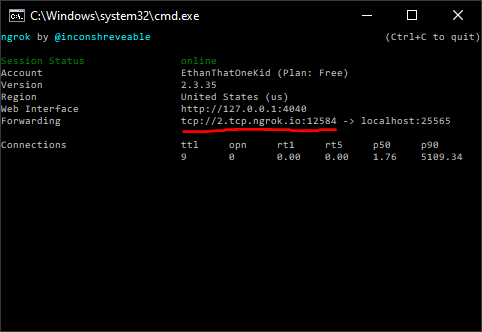

# Simple Minecraft Server 🟩

> How to spin up a Java Edition Minecraft server for you and your friends for free (on Windows)!

## Returning to your World

Run the [`start.bat`](start.bat) file and then the [`connect.bat`](connect.bat) file.

Share your direct connection address with your friends from the window created by the [`connect.bat`](connect.bat) file.

Keep the processes open until you are ready to shut down the server.

## Creating your World

Clone this repository.

Install the latest [Java][java_server_download] Edition server software.

> ☕ If Java is not installed on your machine, you must [install Java][java_download].

Move the `.jar` file to this directory, rename it to `server.jar`, and run the file.

Create an account [with *ngrok*][ngrok_account]. 🛰

Download the [*ngrok* CLI][ngrok_download], move the `.exe` file to this directory, and double-check that it is named `ngrok.exe`.

Copy your *authtoken* from your [*ngrok* dashboard][ngrok_connect].

Open the [`connect.bat`](connect.bat) file in your favorite text editor (notepad works perfectly) and replace `$YOUR_NGROK_AUTHTOKEN` with the token that you copied from the previous step.

To spin up the server for yourself, run the [`start.bat`](start.bat) file.

Run the [`start.bat`](start.bat) file and then the [`connect.bat`](connect.bat) file.

Keep the processes open until you are ready to shut down the server.

## Server Properties 🔑

Review the [server properties documentation][server_properties_wiki] to customize your server.
Do not forget to edit the scripts to run [two commands in parallel](https://stackoverflow.com/a/55519158).

----

Crafted with 💎 by [EthanThatOneKid][creator_site]

[creator_site]: http://www.ethandavidson.com/
[java_download]: https://java.com/en/
[java_server_download]: https://www.minecraft.net/en-us/download/server
[bedrock_server_download]: https://www.minecraft.net/en-us/download/server/bedrock
[ngrok_setup]: https://dashboard.ngrok.com/get-started/setup
[ngrok_success_img]: media/ngrok_success.png
[ngrok_account]: https://dashboard.ngrok.com/login
[ngrok_download]: https://ngrok.com/download
[ngrok_connect]: https://dashboard.ngrok.com/get-started/setup
[ngrok_setup]: #ngrok-setup-
[server_props]: #server-properties-
[server_properties_wiki]: https://minecraft.gamepedia.com/Server.properties
